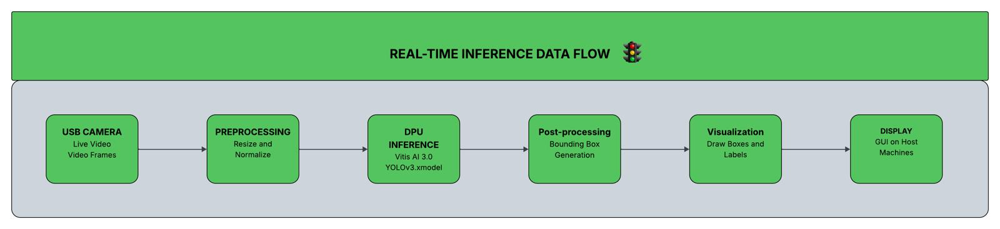

# Edge AI Object Detection on FPGA

A real-time traffic detection system using YOLOv3 neural network accelerated on AMD Zynq UltraScale+ FPGA. This project leverages Vitis AI for traffic monitoring applications with low-latency inference suitable for intelligent transportation systems.

## 🏆 Project Information
- **Competition**: AMD Adaptive Computing Competition
- **Hardware Platform**: AMD Zynq UltraScale+ MPSoC (ZCU104)
- **Framework**: Vitis AI 3.0
- **Model**: YOLOv3 (PyTorch implementation)
- **Development Environment**: Ubuntu 20.04 LTS
- **Application Domain**: Intelligent Transportation Systems

## 🎯 Features
- **Real-time Performance**: 15-30 FPS with ~30ms latency per frame
- **Multiple Deployment Modes**: X11 display and HDMI framebuffer output
- **Traffic-Specific Detection**: 6 classes (2-wheelers, auto, bus, car, pedestrian, truck)
- **FPGA Acceleration**: Optimized for ZCU104 DPUCZDX8G architecture
- **Quantized Model**: INT8 precision for efficient FPGA deployment

## 📁 Project Structure
```
object_detection_on_fpga/
├── dataset/                    # Traffic detection dataset
│   ├── data.yaml              # Dataset configuration
│   ├── train/                 # Training images and labels
│   └── valid/                 # Validation images and labels
├── yolov/                     # YOLOv3 training and quantization
│   ├── train.py              # Training script
│   ├── quant.py              # Model quantization
│   ├── compiled_model/       # FPGA-ready compiled model
│   └── runs/train/           # Training outputs and weights
└── deploy_model/             # FPGA deployment applications
    ├── build.sh              # Build script for all executables
    ├── detect_image.cpp      # Single image inference
    ├── detect_video.cpp      # Video inference (X11 display)
    ├── detect_video_hdmi.cpp # Video inference (HDMI output)
    ├── test_accuracy.cpp     # Model accuracy evaluation
    └── test_video_perf.cpp   # Performance benchmarking
```

## 🚀 Quick Start

### Prerequisites
- Ubuntu 20.04 LTS
- Docker
- AMD Zynq UltraScale+ ZCU104 board
- SD card (8GB+)
- USB camera or video source

### 1. Development Environment Setup
```bash
# Install dependencies
sudo apt update && sudo apt install -y \
    python3-pip python3-dev git wget curl build-essential \
    libopencv-dev python3-opencv docker.io

# Clone Vitis AI
git clone https://github.com/Xilinx/Vitis-AI.git
cd Vitis-AI

# Pull and run Vitis AI Docker
docker pull xilinx/vitis-ai-pytorch-cpu:ubuntu2004-3.0.0.106
./docker_run.sh xilinx/vitis-ai-pytorch-cpu:ubuntu2004-3.0.0.106

# Inside Docker container
conda activate vitis-ai-pytorch
pip install ultralytics
```

### 2. Model Training and Quantization
```bash
# Train YOLOv3 model (3 epochs)
cd yolov
python train.py --data ../dataset/data.yaml --epochs 3

# Quantize model
python quant.py -w runs/train/exp2/weights/best.pt -d ../dataset/valid/

# Compile for FPGA
vai_c_xir -x build/quant_model/DetectMultiBackend_int.xmodel \
    -a /opt/vitis_ai/compiler/arch/DPUCZDX8G/ZCU104/arch.json \
    -o ./compiled_model -n yolov3_quant
```

### 3. FPGA Deployment

#### Board Setup
1. **Flash SD Card**: Download Vitis AI ZCU104 image and flash to SD card
2. **Boot Board**: Insert SD card, set boot mode to SD, power on
3. **Network Setup**: Connect Ethernet and note board IP address
4. **SSH Access**: `ssh -X root@<BOARD_IP>` (use -X for GUI forwarding)

#### Deploy and Run
```bash
# Copy deployment files to board
scp -r deploy_model/ root@<BOARD_IP>:~/
scp -r yolov/compiled_model/ root@<BOARD_IP>:/usr/share/vitis_ai_library/models/yolov3_quant/

# On board: Build executables
cd deploy_model
./build.sh

# Run applications
./detect_video_hdmi yolov3_quant    # HDMI output
./detect_video yolov3_quant         # X11 display
./test_accuracy yolov3_quant        # Accuracy evaluation
./test_video_perf yolov3_quant      # Performance benchmark
```

## 📊 Performance Results
- **Inference Speed**: 27-29 FPS (stable)
- **Latency**: ~30ms per frame
- **Accuracy**: TBD (evaluation in progress)
- **Memory Usage**: Optimized for ZCU104 DPU

## 🔧 Key Components

### Model Architecture
- **Base Model**: YOLOv3 with LeakyReLU activations (SiLU replaced for Vitis AI compatibility)
- **Quantization**: INT8 precision using NNDCT quantizer
- **Target**: DPUCZDX8G architecture optimized for computer vision

### Deployment Applications
- **`detect_video_hdmi`**: Real-time detection with HDMI framebuffer output
- **`detect_video`**: X11-based video display with detection overlay
- **`detect_image`**: Single image inference and result saving
- **`test_accuracy`**: Comprehensive accuracy metrics (precision, recall, mAP)
- **`test_video_perf`**: FPS and latency benchmarking

### Inference flow



## 🎥 Usage Examples

### Real-time Traffic Detection (HDMI)
```bash
./detect_video_hdmi yolov3_quant
```
Displays live camera feed with bounding boxes on HDMI-connected monitor.

### Performance Testing
```bash
./test_video_perf yolov3_quant
```
Benchmarks real-time performance and displays FPS metrics.

### Accuracy Evaluation
```bash
./test_accuracy yolov3_quant
```
Evaluates model performance on validation dataset.

### DEMO
### Demo Video
[](https://youtu.be/lTDqHEZKfvg)

Click the image above to watch our demo video showcasing real-time traffic detection on the ZCU104 board.


## 🔗 References
- [YOLOv3 Repository](https://github.com/ultralytics/yolov3)
- [Vitis AI User Guide 3.0](https://docs.amd.com/r/3.0-English/ug1414-vitis-ai/Vitis-AI-Overview)
- [ZCU104 Board Documentation](https://www.xilinx.com/products/boards-and-kits/zcu104.html)

## 📝 License
This project is part of the AMD Adaptive Computing Competition.

---
**Repository**: https://github.com/jeff4444/object_detection_on_fpga 